# DA_GEI_ChatNet_Brandl_Android

> **Diplomarbeit** — HTBL Hollabrunn, 5BHITS, Schuljahr 2023/24  
> Developed by **Tobias Brandl**

---

## Overview

**ChatNet** is a native Android messaging app built with **Kotlin** and **Jetpack Compose** in Android Studio. It enables real-time communication between users through multiple chat modes — including direct messaging, location-based discovery (DropIn), random chat with strangers, and an AI-powered chat assistant (ChatMate).

The app follows the **MVVM architecture pattern** and uses **Firebase** as its backend (Firestore, Authentication, Storage, Cloud Functions).

---

## Tech Stack

| Technology | Purpose |
|---|---|
| Kotlin | Primary programming language |
| Jetpack Compose | Declarative UI framework |
| Firebase Firestore | Real-time database |
| Firebase Auth | User authentication (Email + Google) |
| Firebase Storage | Image upload & hosting |
| CameraX | In-app camera with live preview |
| OkHttp | API requests to Firebase Cloud Functions |
| Coil | Image loading & caching |

**Supported Android versions:** API Level 24 (Android 7) — API Level 34 (Android 14)

---

## Features

### Authentication
Full login and registration flow with both Email/Password and Google Sign-In, including password reset, email confirmation, and error feedback.

### Chats
A friends-based chat list with real-time message status (sent / delivered / read), typing indicators, online/offline status, and user management (pin, mute, block, clear chat).

### Chat View
Real-time messaging with text and images (camera or gallery). Supports message search, AI-generated replies via ChatMate, image captions, and message deletion per-user or for all participants.

### DropIn
Discover and chat with nearby users based on GPS location. Shows the closest 10 online users who have DropIn enabled, with city-level or distance-based location display.

### RandChat
Connect anonymously with a random online user. Keeps a history of recent RandChat connections.

### ChatMate
AI-powered chat threads using ChatGPT API via Firebase Cloud Functions. Allows users to generate AI responses to selected messages.

### Profile
Edit username, profile picture, and interest tags. Supports logout and account deletion.

### Find Friends
Search users by username, manage incoming/outgoing friend requests, and view mutual connections.

### Camera
Full in-app camera with live preview, front/rear switch, flashlight, configurable flash modes (on/off/auto), and tap-to-focus.

### Dark & Light Mode
The app automatically follows the system color scheme.

---

## Demo Video

---

## Screenshots

> Screenshots of the current state of the Project.

| Login | Register | Chats |
|---|---|---|
| 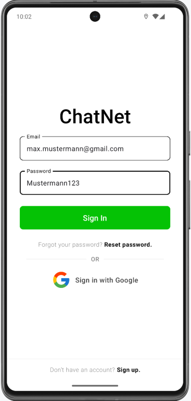 | 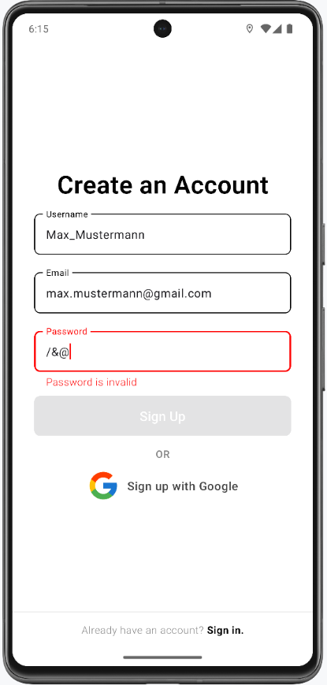 | 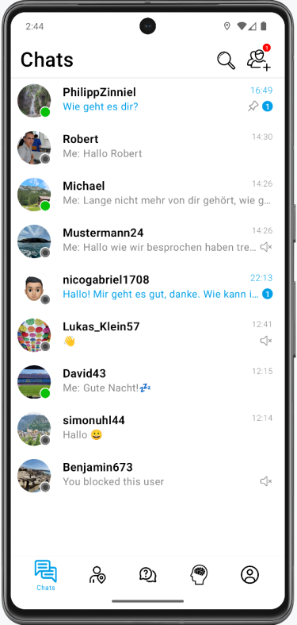 |

| Chat View | DropIn | RandChat |
|---|---|---|
| 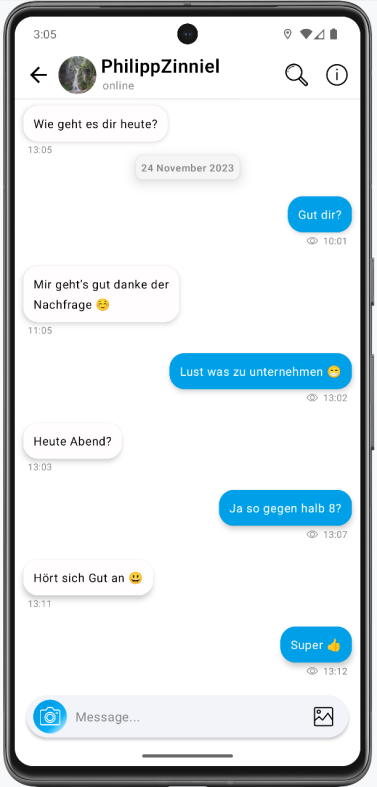 | 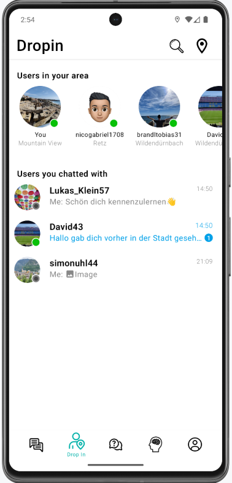 | 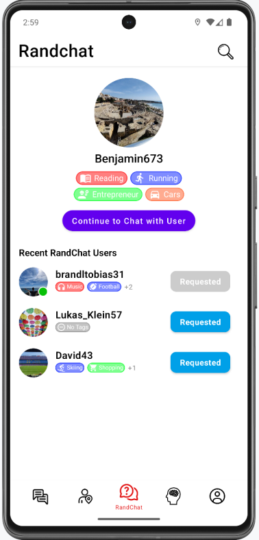 |

| ChatMate | Profile | Find Friends |
|---|---|---|
| 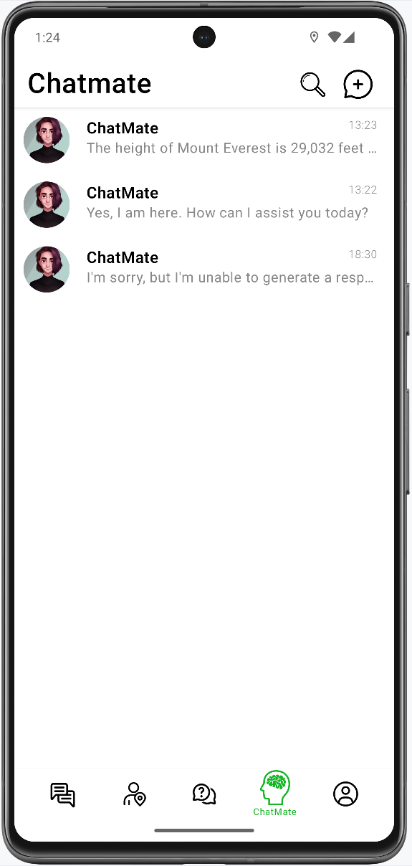 | 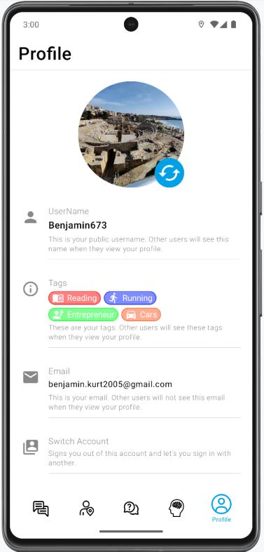 | 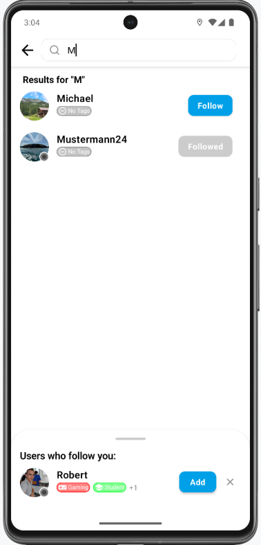 |

| Camera | Camera Photo | Select Tags |
|---|---|---|
| 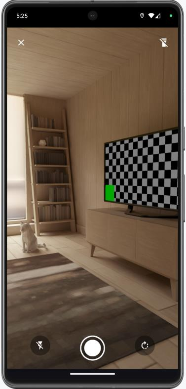 | 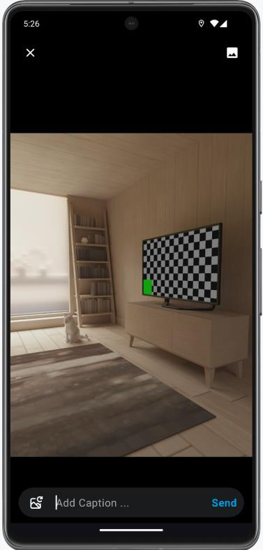 | 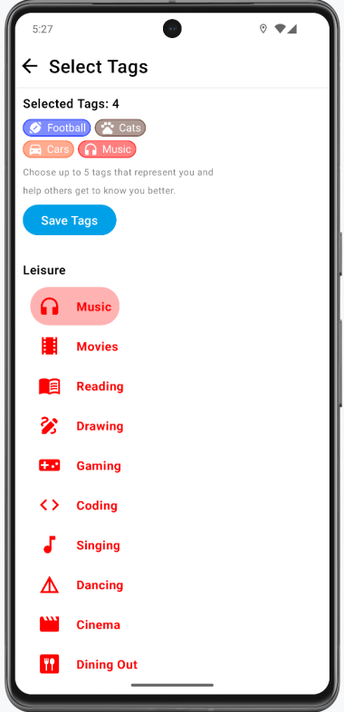 |

---

## Example Users

| Name | E-Mail | Password | Provider |
|---|---|---|---|
| Michael | tobias.brandl2005@gmail.com | — | Google |
| Small | lukas.klein2005@gmail.com | 123456 | Email |
| Ottonaut | davidgebauer2@gmail.com | — | Google |
| Postbert | brandltobias78@gmail.com | — | Google |
| Kurt | benjamin.kurt2005@gmail.com | 123456 | Email |

---

## TODO

Login / Registration

- [x] Login with Google
- [x] Login with E-Mail and Password
- [x] Registration with E-Mail and Password
- [x] Registration with Google
- [x] Logout
- [x] Delete Account
- [x] Reset Password
- [x] Confirm E-Mail
- [x] Change E-Mail
- [x] Change Password
- [x] UI for Login/Registration
- [x] UI for Reset Password Dialog
- [x] UI for Confirm E-Mail Dialog
- [x] Error Handling for Login/Registration

Chats

- [ ] Muted functionality
- [ ] Dark Mode
- [ ] Update icons
- [ ] Empty chats list graphic
- [ ] Rework search

Chat View

- [ ] Center-crop images
- [ ] Pre-determine image orientation
- [ ] Rework message search
- [ ] Dark Mode
- [ ] Offline image handling

DropIn

- [ ] Minor design improvements
- [ ] Dark Mode
- [ ] Muted functionality
- [ ] Visually indicate empty contacts
- [ ] Update DropIn icons
- [ ] Add search functionality

RandChat

- [ ] Complete redesign
- [ ] Bug & issue review
- [ ] Dark Mode

ChatMate

- [ ] Dark Mode
- [ ] Update icons
- [ ] Offline handling

Profile

- [ ] Add tags
- [ ] Dark Mode
- [ ] DropIn settings
- [ ] Delete account functionality

Camera

- [ ] Rework input field send functionality
- [ ] Style input field

Friends

- [ ] Minor design adjustments
- [ ] Dark Mode
- [ ] Add tags

ProfileInfoView

- [ ] Design rework
- [ ] Dark Mode
- [ ] Add tags

General

- [ ] Implement Push Notifications
- [ ] Rework Push Notifications
- [ ] Public user profile

---

## Status
 
Currently not publicly accessible due to missing message decryption, and cost of Firebase server side storage.
